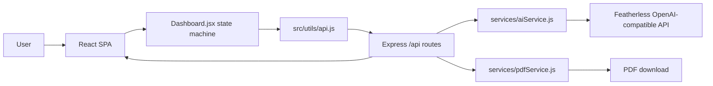
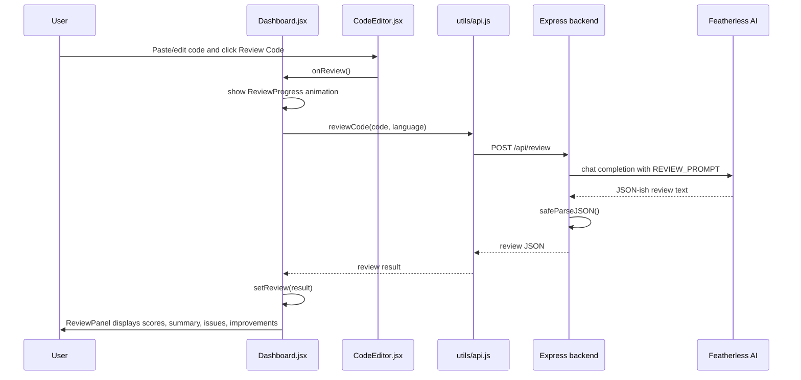

# CodeReview AI - Full Project Structure and Agent Handoff

Project path: `E:/Web Development/Web Projects/code reviewer`

Purpose: a React + Express app where a student pastes code, selects a language, receives AI review feedback, can request fixed/refactored code, chat with an AI mentor, get a learning roadmap, and export a PDF report.

Important correction: the README says the AI backend uses NVIDIA/Gemma. The actual running backend uses Featherless via the OpenAI SDK:

- API base URL: `https://api.featherless.ai/v1`
- Required env var: `FEATHERLESS_API_KEY`
- Model: `NousResearch/Meta-Llama-3-70B-Instruct`

## Top-Level Layout

```text
code reviewer/
├── package.json                 # Root scripts for installing/running both apps
├── README.md                    # Existing docs, partially outdated
├── backend/                     # Express API server
│   ├── server.js                # App entry point, middleware, route mounting
│   ├── package.json             # Backend dependencies/scripts
│   ├── render.yaml              # Render deployment config
│   ├── middleware/
│   │   ├── rateLimiter.js       # Global /api rate limits
│   │   └── errorHandler.js      # Final Express error handler
│   ├── routes/
│   │   ├── review.js            # POST /api/review, GET /api/health
│   │   ├── fixCode.js           # POST /api/fix-code
│   │   ├── explain.js           # POST /api/explain
│   │   ├── chat.js              # POST /api/chat, SSE stream
│   │   ├── learn.js             # POST /api/learn/recommend
│   │   ├── export.js            # POST /api/export/pdf
│   │   ├── testReview.js        # POST /api/test-review, manual AI/env test
│   │   └── refactor.js          # Unmounted/dead route; currently broken
│   └── services/
│       ├── aiService.js         # AI prompts, OpenAI-compatible calls, parsing, cache
│       └── pdfService.js        # PDFKit report generation
└── frontend/                    # React + Vite SPA
    ├── package.json             # Frontend dependencies/scripts
    ├── vite.config.js           # Vite dev server, /api proxy to backend
    ├── vercel.json              # SPA rewrite and headers
    ├── index.html
    └── src/
        ├── main.jsx             # React root + BrowserRouter
        ├── App.jsx              # Routes: / and /dashboard
        ├── utils/api.js         # All frontend API calls
        ├── pages/
        │   ├── Landing.jsx      # Marketing/home page
        │   └── Dashboard.jsx    # Main application state and workflow
        └── components/          # Editor, review, chat, learning, diff, UI pieces
```

## How The App Starts

Root scripts in `package.json`:

```text
npm run install:all      -> installs backend and frontend dependencies
npm run dev              -> starts backend and frontend concurrently
npm run dev:backend      -> cd backend && npm run dev
npm run dev:frontend     -> cd frontend && npm run dev
npm run build            -> cd frontend && npm run build
npm start                -> cd backend && npm start
```

Backend:

- `backend/server.js` loads `.env`, creates an Express app, applies security/CORS/JSON/rate-limit middleware, mounts route modules under `/api`, then listens on `0.0.0.0:${PORT || 5000}`.
- The backend imports `aiService.js` at startup through route modules. Because `aiService.js` constructs the OpenAI client immediately, the backend can fail during startup if no acceptable API key is present.

Frontend:

- `frontend/src/main.jsx` mounts React with `BrowserRouter`.
- `frontend/src/App.jsx` defines two routes:
  - `/` -> `Landing`
  - `/dashboard` -> `Dashboard`
- Vite dev server runs on port `3000`.
- During local development, `frontend/vite.config.js` proxies `/api` to `http://localhost:5000`.

## Runtime Architecture



## Core Frontend State Flow

`Dashboard.jsx` is the center of the frontend. It owns:

- `code`: current editor contents.
- `language`: selected language.
- `review`: result from `/api/review`.
- `loading`, `showProgress`, `error`: review status.
- `fixing`, `fixResult`, `fixLoading`: Fix My Code modal state.
- `activeTab`: `review`, `chat`, or `learning`.
- `learning`, `learningLoading`: learning roadmap state.
- `focusedLine`: line number to scroll Monaco to.

Primary UI flow:



## API Base URL

`frontend/src/utils/api.js` defines:

```js
const API_URL = import.meta.env.VITE_API_URL || '/api';
```

Local development:

- Browser calls `/api/...`.
- Vite proxy sends those requests to `http://localhost:5000`.

Production:

- If frontend and backend are on different hosts, set `VITE_API_URL` to the backend's full API base URL, usually something like `https://your-backend.onrender.com/api`.

## Backend Middleware Stack

Order in `backend/server.js`:

1. `helmet()`
2. `cors(...)`
3. `express.json({ limit: '5mb' })`
4. `app.use('/api', apiLimiter)`
5. Route modules mounted under `/api`
6. `errorHandler`

CORS:

- Uses `process.env.CORS_ORIGIN.split(',')` if set.
- Defaults to `http://localhost:5173` and `http://localhost:3000`.
- Allows `GET`, `POST`, and `Content-Type`.

Rate limiting:

- `apiLimiter`: 20 requests per minute per IP.
- `authLimiter`: 10 requests per minute, exported but currently unused.

## API Contracts

### GET `/api/health`

Defined in `backend/routes/review.js`.

Returns:

```json
{
  "status": "ok",
  "aiConfigured": true,
  "apiKeyLoaded": true,
  "model": "NousResearch/Meta-Llama-3-70B-Instruct",
  "timestamp": "2026-06-04T..."
}
```

### POST `/api/review`

Frontend function: `reviewCode(code, language)`.

Request:

```json
{
  "code": "source code string",
  "language": "javascript|python|java|c++|c|typescript"
}
```

Backend function: `reviewCode(code, language)` in `aiService.js`.

Expected AI response shape:

```json
{
  "overallScore": 78,
  "readabilityScore": 70,
  "efficiencyScore": 80,
  "correctnessScore": 85,
  "summary": "Short explanation",
  "strengths": ["..."],
  "issues": ["..."],
  "improvements": ["..."],
  "timeComplexity": "O(n)",
  "spaceComplexity": "O(1)"
}
```

The route returns the AI result plus `language`.

Important shape note: older/unused components expect richer objects such as `issues[].description`, `issues[].severity`, `complexityAnalysis`, and `lineFeedback`. The current live review prompt returns simple string arrays and top-level `timeComplexity`/`spaceComplexity`.

### POST `/api/fix-code`

Frontend function: `fixCode(code, language)`.

Request:

```json
{
  "code": "source code string",
  "language": "javascript|python|java|c++|c|typescript"
}
```

Expected response:

```json
{
  "improvedCode": "full refactored source code",
  "changes": [
    {
      "change": "what changed",
      "reason": "why it improves the code"
    }
  ],
  "summary": "short summary",
  "originalCode": "original code",
  "language": "javascript"
}
```

Frontend display: `CodeComparisonView.jsx` opens a Monaco `DiffEditor` modal.

### POST `/api/explain`

Frontend function: `explainIssue(code, language, issue)`.

Request:

```json
{
  "code": "source code string",
  "language": "javascript|python|java|c++|c|typescript",
  "issue": "issue text"
}
```

Expected response:

```json
{
  "explanation": "2-3 sentence explanation",
  "fixExample": "brief code snippet",
  "resourceLink": "optional concept name"
}
```

Current UI note: this API exists in `api.js`, but the simplified current `ReviewPanel.jsx` does not call it.

### POST `/api/chat`

Frontend function: `sendChatMessage(...)`.

Request:

```json
{
  "message": "student question",
  "code": "current code",
  "language": "javascript",
  "reviewContext": { "review": "object" },
  "history": [
    { "role": "user", "content": "..." },
    { "role": "assistant", "content": "..." }
  ]
}
```

Response type: Server-Sent Events.

Each event:

```text
data: {"text":"accumulated assistant text"}
```

Final event:

```text
data: {"done":true}
```

Important behavior: backend sends the accumulated full text on every chunk, not just the delta. The frontend also appends every `data.text` to `fullText`, so its internal returned `fullText` can duplicate content. The UI callback uses the accumulated text directly, so visible streaming mostly works, but final stored message can be wrong because of React state timing.

### POST `/api/learn/recommend`

Frontend function: `recommendLearning(code, language, review)`.

Request:

```json
{
  "code": "source code string",
  "language": "javascript",
  "review": { "review result": "object" }
}
```

Expected response:

```json
{
  "weakAreas": [
    { "area": "topic", "description": "why", "severity": "beginner|intermediate|advanced" }
  ],
  "recommendedTopics": [
    { "topic": "concept", "reason": "why", "difficulty": "beginner|intermediate|advanced" }
  ],
  "practiceQuestions": [
    { "title": "problem", "description": "brief", "topics": ["tag"], "difficulty": "easy|medium|hard" }
  ],
  "learningPath": {
    "steps": [
      { "step": 1, "title": "title", "description": "what", "estimatedTime": "time" }
    ],
    "totalEstimatedTime": "total"
  },
  "overallDifficulty": "beginner|intermediate|advanced",
  "motivationalMessage": "message"
}
```

Frontend display: lazy-loaded `LearningRoadmap.jsx`.

### POST `/api/export/pdf`

Frontend function: `exportPDF(review, code, language)`.

Request:

```json
{
  "review": { "review result": "object" },
  "code": "current code",
  "language": "javascript"
}
```

Response: PDF binary download.

Backend service: `generateReviewPDF(reviewData)` in `pdfService.js`.

Current mismatch: `export.js` sends `code`, but `pdfService.js` only draws `reviewData.improvedCode`, so the pasted original code is not included in the report unless the review object already has `improvedCode`.

### POST `/api/test-review`

Manual backend diagnostic endpoint. It checks whether `FEATHERLESS_API_KEY` exists, then tries a sample review.

Not used by the frontend.

### POST `/api/refactor`

This route file exists but is not mounted in `server.js`. It imports `refactorCode` from `aiService.js`, but `aiService.js` does not export `refactorCode`. If mounted or called, it will fail.

## AI Service Internals

File: `backend/services/aiService.js`

Exports:

- `reviewCode`
- `fixCode`
- `explainIssue`
- `chatCompletion`
- `generateLearning`
- `dedup`
- `safeParseJSON`
- `logMetrics`
- `MOCK_REVIEW`
- `MOCK_FIX`

Major helpers:

- `safeParseJSON(content)`: strips code fences, tries full JSON parse, then tries first `{...}` match.
- `cacheKey(code, lang)`: uses language, first 200 chars, and code length.
- `getCached`/`setCache`: 60 second in-memory cache for reviews.
- `dedup(key, factory)`: in-flight promise dedup helper.

Important issue: `dedup` is exported and imported in routes, but the route handlers do not currently use it. Review caching happens inside `reviewCode`; fix/explain/chat/learn have no cache.

## Frontend Component Map

Active path from the dashboard:

```text
Dashboard.jsx
├── Navbar.jsx
├── LanguageSelector.jsx
├── CodeEditor.jsx
├── ReviewProgress.jsx
├── LoadingSkeleton.jsx
├── ErrorMessage.jsx
├── ReviewPanel.jsx
├── MentorChat.jsx
│   ├── ChatMessage.jsx
│   └── ChatInput.jsx
├── LearningRoadmap.jsx
└── CodeComparisonView.jsx
```

Landing page path:

```text
Landing.jsx
├── Navbar.jsx
├── DotField.jsx
└── Footer.jsx
```

Mostly unused or legacy components in the current UI:

- `IssueCard.jsx`
- `ImprovementCard.jsx`
- `ComplexityCard.jsx`
- `LineFeedbackPanel.jsx`
- `ReviewSummary.jsx`
- `ScoreCard.jsx`
- `StrengthCard.jsx`
- `FeatureCard.jsx`
- `FloatingCard.jsx`
- `BentoCard.jsx`

These are not necessarily bad, but they reflect an older richer review schema. If Claude wants line-level feedback, it should update the backend review prompt and reconnect these components.

## Data Shape Mismatches To Watch

Current live review prompt returns:

```json
{
  "issues": ["string"],
  "improvements": ["string"],
  "timeComplexity": "O(n)",
  "spaceComplexity": "O(1)"
}
```

Some code expects:

```json
{
  "issues": [
    {
      "severity": "high",
      "type": "bug",
      "line": 4,
      "description": "..."
    }
  ],
  "lineFeedback": [
    {
      "lineNumber": 4,
      "severity": "critical",
      "issue": "...",
      "suggestion": "..."
    }
  ],
  "complexityAnalysis": {
    "timeComplexity": "O(n)",
    "spaceComplexity": "O(1)",
    "explanation": "..."
  }
}
```

Files affected by richer expectations:

- `backend/routes/chat.js`
- `backend/routes/learn.js`
- `backend/services/pdfService.js`
- `frontend/src/components/MentorChat.jsx`
- `frontend/src/components/ComplexityCard.jsx`
- `frontend/src/components/LineFeedbackPanel.jsx`
- `frontend/src/components/IssueCard.jsx`
- `frontend/src/components/CodeEditor.jsx`

## Known Errors And Risks

These are the concrete issues found during inspection and verification.

### 1. Backend can crash at startup without an API key

File: `backend/services/aiService.js`

`new OpenAI({ apiKey: process.env.FEATHERLESS_API_KEY })` is created at module load time. With no env var, the OpenAI SDK throws immediately. This means routes like `/api/health` cannot start and report `aiConfigured: false`.

Observed command result:

```text
Error: Missing credentials. Please pass an apiKey...
```

Suggested fix: create the OpenAI client lazily after checking `FEATHERLESS_API_KEY`, or pass a placeholder and fail only inside AI call functions.

### 2. README AI provider/env instructions are wrong

File: `README.md`

README says NVIDIA API and `NVIDIA_API_KEY`; live code uses Featherless and `FEATHERLESS_API_KEY`.

Suggested fix: update README setup, architecture, tech stack, and `.env` example.

### 3. `/refactor` route is broken and not mounted

File: `backend/routes/refactor.js`

It imports `refactorCode`, but `aiService.js` does not define or export that function. The route is also not mounted in `server.js`.

Suggested options:

- Delete `refactor.js` if `fix-code` replaced it.
- Or mount it and implement/export `refactorCode`.
- Or make `/refactor` call existing `fixCode`.

### 4. PDF export does not include original code

Files:

- `backend/routes/export.js`
- `backend/services/pdfService.js`

`export.js` sends `reviewData.code`, but `pdfService.js` only calls:

```js
drawCodeBlock(doc, 0, reviewData.improvedCode, 'Improved Code')
```

So normal review exports omit the pasted code because review results do not include `improvedCode`.

Suggested fix: draw `reviewData.code` as `Original Code`, and only draw `improvedCode` if present.

### 5. PDF code syntax keyword lookup uses the code text instead of language

File: `backend/services/pdfService.js`

Inside `drawCodeBlock(doc, y, code, label)`:

```js
const langKeywords = keywords[code.toLowerCase()] || keywords.default;
```

That uses the full source code as the lookup key. It should accept a `language` parameter and use `keywords[language]`.

### 6. Chat streaming has accumulation/state bugs

Files:

- `backend/routes/chat.js`
- `backend/services/aiService.js`
- `frontend/src/utils/api.js`
- `frontend/src/components/MentorChat.jsx`

Backend `chatCompletion` calls `onChunk(fullText)`, so every SSE event sends the accumulated answer. Frontend `sendChatMessage` then does `fullText += data.text`, duplicating accumulated chunks internally. `MentorChat.jsx` also appends `currentStreamText` in `finally`, but `currentStreamText` can be stale because React state updates are asynchronous.

Suggested fix:

- Backend sends deltas only, or frontend treats `data.text` as accumulated and assigns instead of appending.
- In `MentorChat`, keep a local `assistantText` variable returned from `sendChatMessage`, then append that exact value to messages.

### 7. Suggested chat questions assume object issues, but current issues are strings

File: `frontend/src/components/MentorChat.jsx`

```js
review.issues[0].description?.slice(0, 40)
```

Current `issues[0]` is a string, so this produces `undefined` in the suggested question.

Suggested fix: handle both string and object issue shapes.

### 8. Line feedback feature is disconnected

Files:

- `frontend/src/pages/Dashboard.jsx`
- `frontend/src/components/CodeEditor.jsx`
- `frontend/src/components/LineFeedbackPanel.jsx`
- `backend/services/aiService.js`

`CodeEditor` can show Monaco line decorations, but `Dashboard` passes:

```jsx
lineFeedback={[]}
```

The backend review prompt also does not request `lineFeedback`.

Suggested fix: expand the review schema to include `lineFeedback`, pass `review.lineFeedback || []` into `CodeEditor`, and render `LineFeedbackPanel` or equivalent in `ReviewPanel`.

### 9. Frontend API cache may return stale reviews/fixes

File: `frontend/src/utils/api.js`

The cache key uses only the first 100 chars and language:

```js
review:${code.slice(0,100)}:${language}
fix:${code.slice(0,100)}:${language}
```

Two different snippets with the same first 100 chars can collide. There is no TTL or invalidation.

Suggested fix: key by the full code hash plus language, and add TTL or clear cache when needed.

### 10. Backend review cache can collide

File: `backend/services/aiService.js`

The cache key uses first 200 chars and code length. Different code can collide if the prefix and length match.

Suggested fix: use a real hash of full code plus language.

### 11. Frontend security audit reports moderate DOMPurify vulnerabilities through Monaco

Command run: `npm audit --omit=dev --audit-level=high` in `frontend/`

Result:

- 2 moderate vulnerabilities.
- Package path: `monaco-editor -> dompurify`.
- `npm audit fix` is available.

Backend audit result: 0 vulnerabilities.

### 12. Review and PDF complexity fields disagree

Current review returns top-level:

```json
{
  "timeComplexity": "O(n)",
  "spaceComplexity": "O(1)"
}
```

`pdfService.js`, `chat.js`, and `learn.js` look for:

```js
review.complexityAnalysis.timeComplexity
review.complexityAnalysis.spaceComplexity
```

This means complexity may display in the current `ReviewPanel`, but may be missing from chat/learning context and PDFs.

Suggested fix: normalize review data after parsing, or standardize the prompt and all consumers on one shape.

## Verification Performed

Frontend production build:

```text
cd frontend
npm run build
```

Result: passed.

Backend dependency audit:

```text
cd backend
npm audit --omit=dev --audit-level=high
```

Result: 0 vulnerabilities.

Frontend dependency audit:

```text
cd frontend
npm audit --omit=dev --audit-level=high
```

Result: moderate DOMPurify vulnerabilities via Monaco.

Backend module load without API key:

```text
cd backend
node -e "const svc=require('./services/aiService')"
```

Result: failed with missing credentials, confirming startup risk when `FEATHERLESS_API_KEY` is absent.

## Recommended Fix Order For Claude

1. Make backend start without crashing when `FEATHERLESS_API_KEY` is missing.
2. Standardize the review response schema across backend prompts, frontend rendering, chat context, learning context, and PDF export.
3. Fix chat SSE accumulation and `MentorChat` final-message state handling.
4. Fix PDF export to include original code and correct language-aware syntax highlighting.
5. Remove or repair the dead `/refactor` route.
6. Reconnect line feedback if the product should truly support line-by-line review.
7. Update README to Featherless and current API contracts.
8. Improve frontend/backend cache keys with full-code hashes.
9. Run `npm audit fix` in frontend and retest build.

## Quick Mental Model

The project is not a complex full-stack app with a database. It is a stateless AI proxy and report generator:

- The frontend owns all user session state in React.
- The backend validates request bodies, builds prompts, calls Featherless, parses JSON, and returns structured responses.
- There is no authentication, no persistent storage, no user accounts, and no database.
- The main fragility is not routing; it is inconsistent data schemas between old rich-review UI pieces and the current simplified AI prompt.

